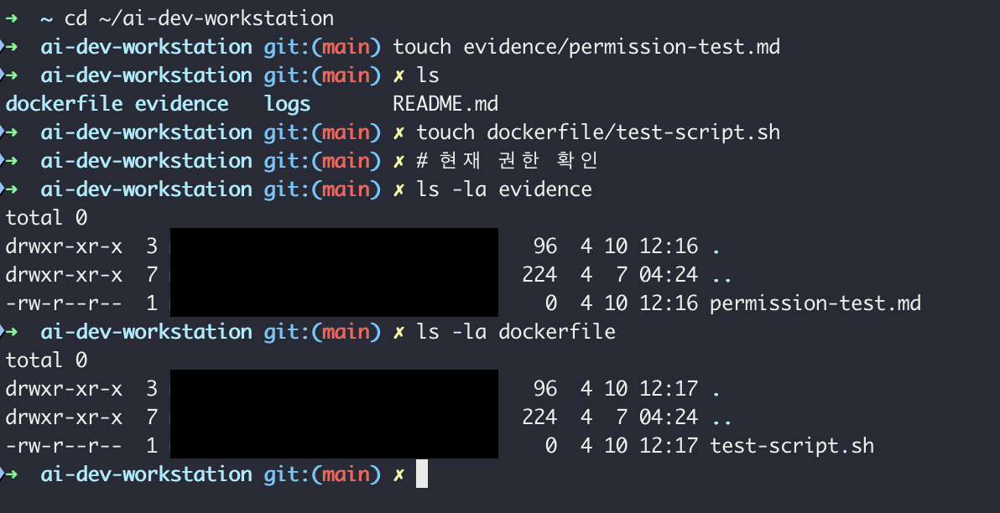
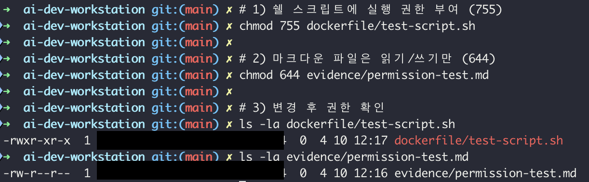
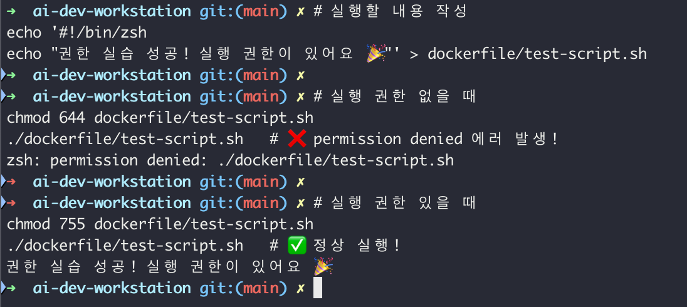

# Permission Test

## 권한 개념 정리

| 기호 | 의미   | 숫자 |
|------|--------|------|
| r    | 읽기   | 4    |
| w    | 쓰기   | 2    |
| x    | 실행   | 1    |
| -    | 권한없음 | 0  |

## 실습 결과

### chmod 755 (test-script.sh)
- 변경 전: -rw-r--r-- (644)
- 변경 후: -rwxr-xr-x (755)
- 의미: 소유자 읽기+쓰기+실행 / 그룹,기타 읽기+실행

### chmod 644 (permission-test.md)
- 변경 전: -rw-r--r-- (644) → 기본값과 동일
- 변경 후: -rw-r--r-- (644)
- 의미: 소유자 읽기+쓰기 / 그룹,기타 읽기만

## 실행 권한 테스트

### 실행 권한 없을 때 (644)
```zsh
chmod 644 test-script.sh
./test-script.sh
→ zsh: permission denied: ./dockerfile/test-script.sh
```

### 실행 권한 있을 때 (755)
```zsh
chmod 755 test-script.sh
./test-script.sh
→ 권한 실습 성공! 실행 권한이 있어요 🎉
```

## 스크린샷
### 변경 전 권한


### 변경 후 권한


### 실행 권한 비교

