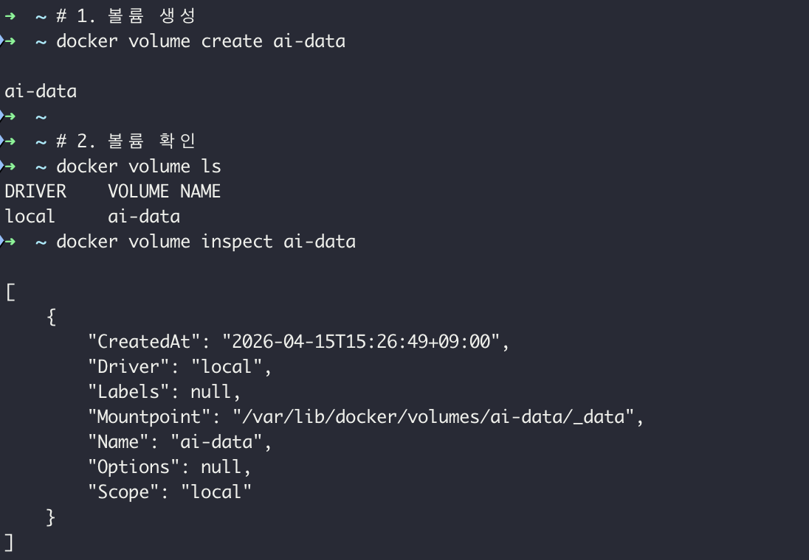
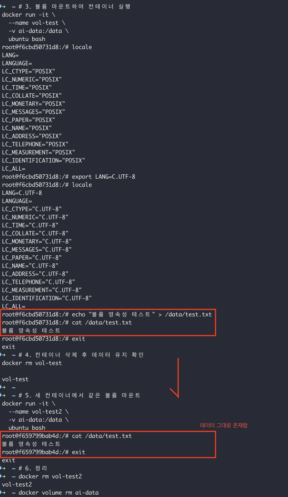

# Volume Test

## 볼륨 개념

### 컨테이너는 삭제되면 내부 데이터도 사라짐
→ 볼륨(Volume)을 사용하면 컨테이너 외부에 데이터 저장<br>
→ 컨테이너가 삭제되어도 데이터 유지!

## 실습 흐름

```
1. docker volume create ai-data       # 볼륨 생성
2. 컨테이너 실행 + 볼륨 마운트              # -v ai-data:/data
3. /data/test.txt 파일 생성             # 컨테이너 내부
4. 컨테이너 삭제                         # docker rm vol-test
5. 새 컨테이너에서 같은 볼륨 마운트          # 데이터 유지 확인!
```

## 검증 결과
- vol-test 컨테이너 삭제 후
- vol-test2 에서 /data/test.txt 내용 그대로 확인
- → 볼륨 영속성 검증 완료 ✅

## 스크린샷


