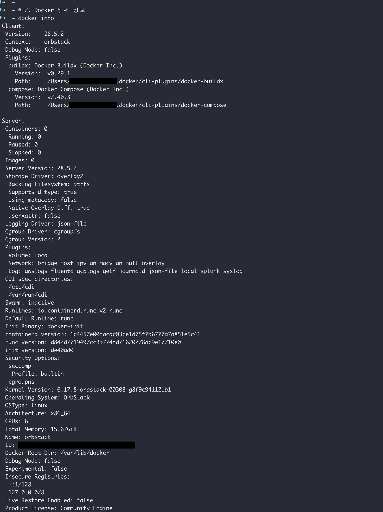
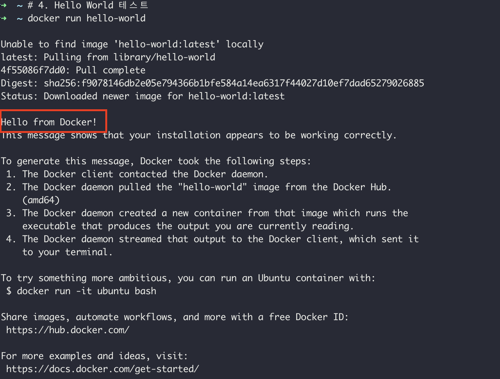
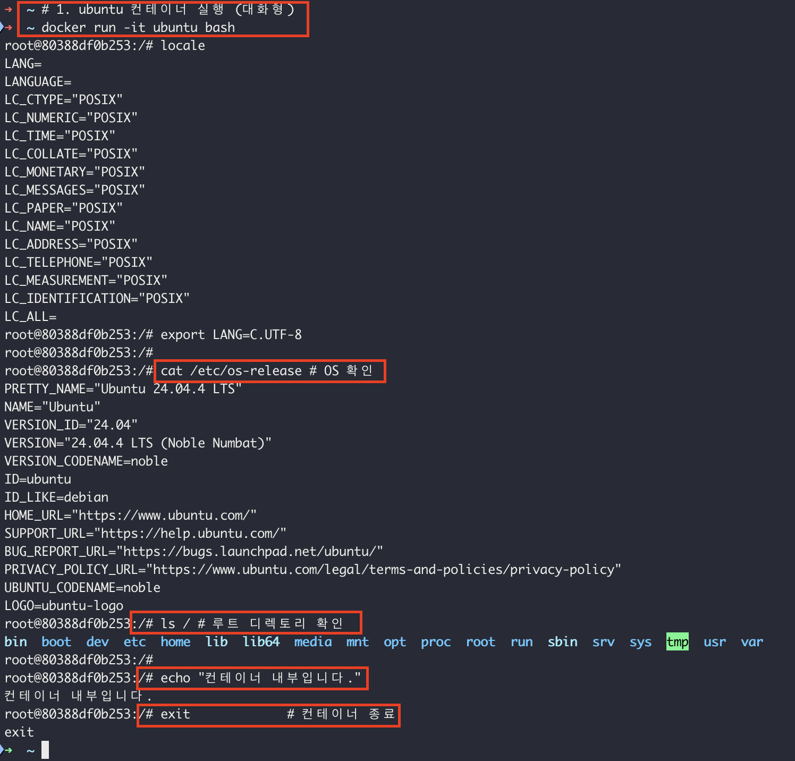
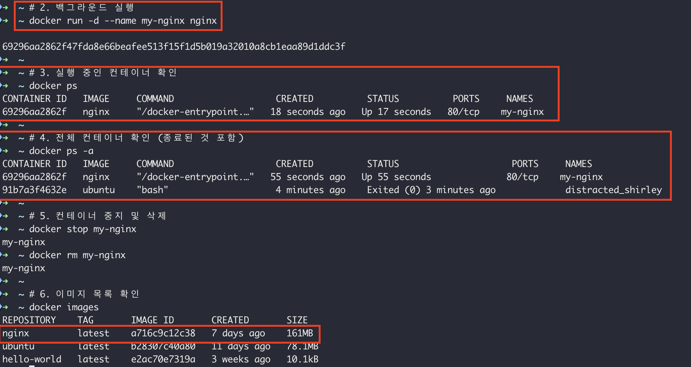
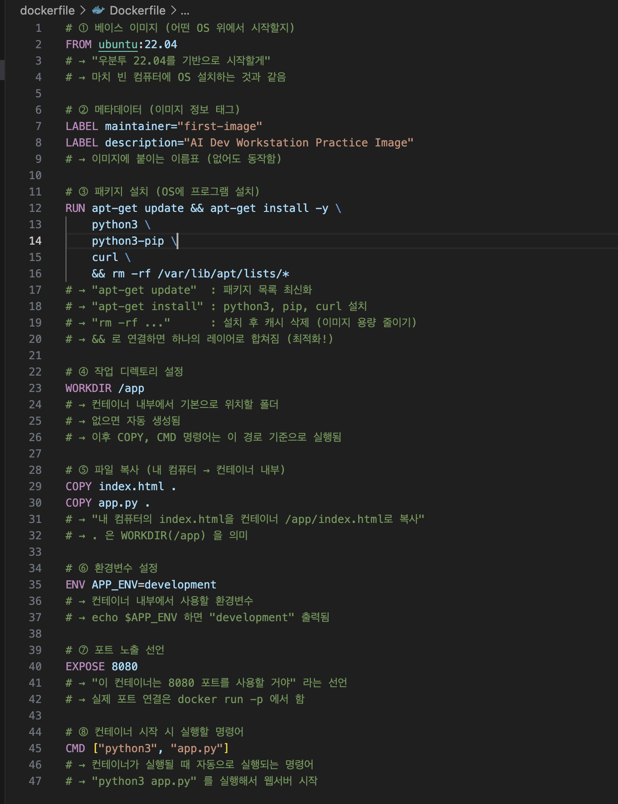
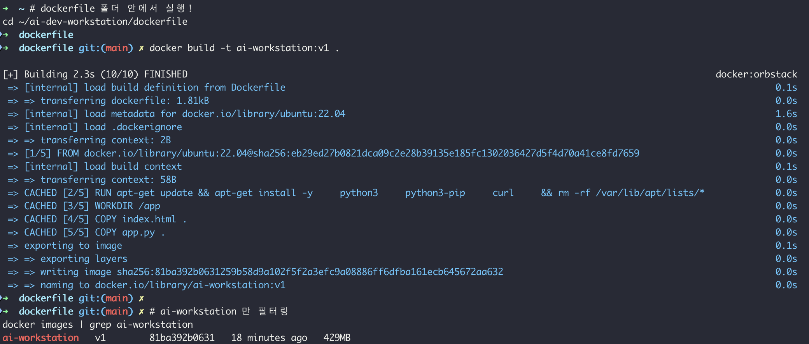
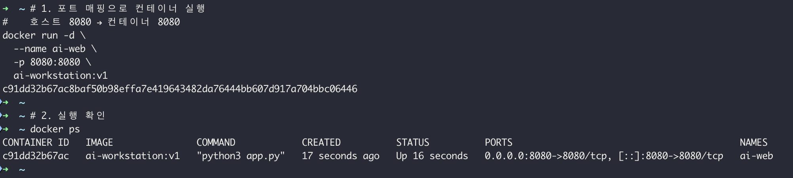
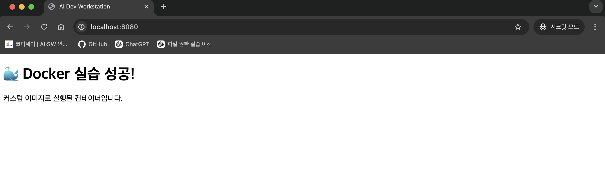

# Docker Logs

##  1. Docker 설치 점검

### 버전 정보
- Docker version 28.5.2, build ecc6942

### docker info 주요 항목
- Server Version: `28.5.2`
- Storage Driver: `overlay2`
- Total Memory: `15.67GiB`

### hello-world 실행 결과
docker run hello-world<br>
→ Hello from Docker!<br>
→ 이미지 pull → 컨테이너 실행 → 출력 → 종료 정상 확인

## 스크린샷




## 2. 컨테이너 기본 실행

### 주요 명령어 정리
| 명령어 | 설명 |
|--------|------|
| docker run -it ubuntu bash | 대화형 컨테이너 실행 |
| docker run -d --name [이름] [이미지] | 백그라운드 실행 |
| docker ps | 실행 중인 컨테이너 목록 |
| docker ps -a | 전체 컨테이너 목록 |
| docker stop [이름] | 컨테이너 중지 |
| docker rm [이름] | 컨테이너 삭제 |

### 컨테이너 종료/유지
#### 컨테이너는 **메인 프로세스(PID 1)** 가 살아있어야 유지된다.

| 명령어 | 접속 방식 | 종료 시 컨테이너 |
|--------|-----------|-----------------|
| `docker run` | 새 컨테이너 생성 | 메인 프로세스 종료 → **컨테이너도 종료** |
| `docker attach` | **메인 프로세스**에 직접 연결 | `exit` 입력 → **컨테이너 종료** ⚠️ |
| `docker exec` | **새 프로세스** 추가 실행 | `exit` 입력 → **컨테이너 유지** ✅ |

---

```zsh
# attach: 메인 프로세스에 붙음 → exit하면 컨테이너 죽음
docker attach my_container

# exec: 새 bash 실행 → exit해도 컨테이너 살아있음
docker exec -it my_container bash
```

### attach에서 컨테이너 안 죽이고 나오려면?

```
Ctrl + P → Ctrl + Q   # 컨테이너 유지하면서 detach
```

> **`attach`** = 메인 프로세스 직접 연결 (exit → 컨테이너 종료)  
> **`exec`** = 새 프로세스 추가 (exit → 컨테이너 유지)  
> **실무에서는 `exec -it` 를 주로 사용!**

### 실행 결과
- ubuntu 컨테이너 진입 및 내부 명령어 실행 확인
- nginx 백그라운드 실행 → 중지 → 삭제 완료

## 스크린샷




## 3. 커스텀 이미지 제작

### Dockerfile 구조
| 명령어 | 역할 |
|--------|------|
| FROM | 베이스 이미지 지정 |
| LABEL | 메타데이터 추가 |
| RUN | 빌드 시 명령어 실행 |
| WORKDIR | 작업 디렉토리 설정 |
| COPY | 파일 복사 |
| ENV | 환경변수 설정 |
| EXPOSE | 포트 노출 선언 |
| CMD | 컨테이너 시작 시 실행 명령어 |

### 빌드 결과
- 이미지명: ai-workstation:v1
- 베이스: ubuntu:22.04
- 설치 패키지: python3, pip, curl

## 스크린샷




## 4. 포트 매핑 테스트

### 포트 매핑 개념
호스트(Mac) 컨테이너<br>
8080 →→→→→ 8080<br>
localhost:8080 으로 접속하면 컨테이너 내부 8080 포트로 연결됨

### 명령어
```zsh
docker run -d --name ai-web -p 8080:8080 ai-workstation:v1
```

### 실행 결과
- curl http://localhost:8080 → HTML 응답 확인
- docker logs ai-web → 접속 로그 확인

## 스크린샷



