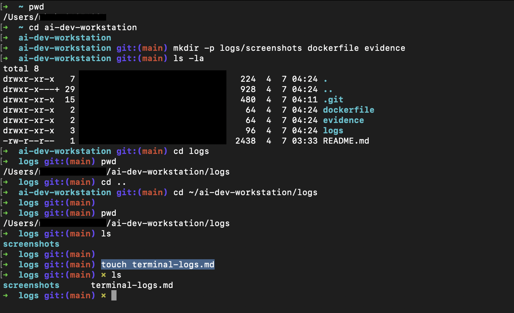

# Terminal Logs

```zsh
# 1. 현재 위치 확인 (절대 경로)
pwd

# 2. 프로젝트 폴더로 이동
cd ~/ai-dev-workstation

# 3. 디렉토리 구조 생성
# -p 중간 경로 자동 생성, 이미 있어도 에러 없음
mkdir -p logs/screenshots dockerfile evidence

# 4. 파일 목록 확인
ls -la

# 5. 절대경로 vs 상대경로 체험
cd logs          # 상대 경로
pwd              # 현재 위치 확인
cd ..            # 상위로 이동
cd ~/ai-dev-workstation/logs  # 절대 경로
pwd

# 6. logs에 terminal-logs.md 파일 생성
touch terminal-logs.md

```

